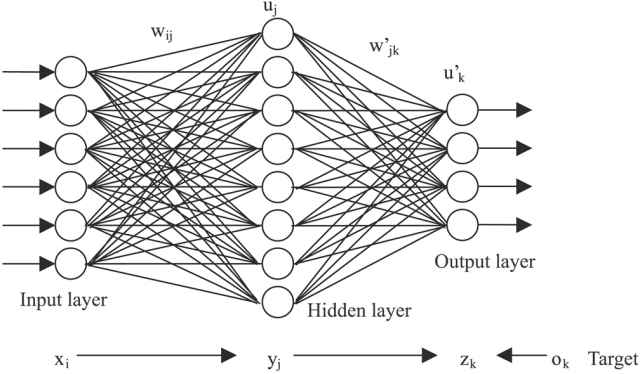

```{r setup, include=FALSE}
knitr::opts_chunk$set(echo = TRUE)
```

### Requisitos

Este notebook es un R Markdown que fue desarrollado en RStudio para ser ejecutado con código en Python3. Por lo tanto, además de tener instalado Python3, se debe instalar desde la consola de RStudio o en la terminal ejecutando R la biblioteca Reticulate para ligar Python con R, mediante el comando:

```{r eval=FALSE}
install.packages("reticulate")
```

Además, se requiere instalar las siguientes bibliotecas desde Python3 con los comandos respectivos desde la terminal.

-Pandas

```{python eval=FALSE}
pip3 install pandas
```

-Numpy

```{python eval=FALSE}
pip3 install numpy
```

-Matplotlib

```{python eval=FALSE}
pip3 install matplotlib
```

-Scikit Learn

```{python eval=FALSE}
pip3 install scikit-learn
```

-Tensorflow

En la terminal se instala la dependencia Testtresources:
```{python eval=FALSE}
sudo apt install python3-testresources
```

Luego, se instala Tensorflow con el siguiente comando:
```{python eval=FALSE}
pip3 install tensorflow
```

## Introducción

## Conceptos Claves

### - Machine Learning

### - Redes Neuronales

### - Recurrent Neural Network (RNN)

### - Long Short-Term Memory (LSTM)

### - RNN vs LSTM



## Bibliotecas Implementadas

### - TensorFlow

### - Keras


## Implementación en Python

A continuación se implementa el análisis de los datos en Python mediante la utilización de distintas bibliotecas. Se procede a mostrar el código fuente, así como la salida obtenida de este con una detallada descripción del mismo.

### 1. Importar las bibliotecas a utilizar.


```{python}
import pandas as pd

import numpy as np

import math

import matplotlib.pyplot as plt

from sklearn.preprocessing import MinMaxScaler

import tensorflow as tf
from tensorflow.keras.models import Sequential
from tensorflow.keras.layers import Dense, Dropout, LSTM

```

### 2. Funciones.

#### a. Cargar datos csv:

Se carga el archivo csv en la variable. Retorna el data frame con las columnas de interés.

```{python}
def CargarArchivo(file, online=False):
    if online:
    # Se carga el archivo online
        datos = pd.read_csv(file)
    else:
    # Se carga el archivo local
	    datos = pd.read_csv('../Datos/' + file)
	
	#Se convierte en data frame con pandas 
    datos_pd = pd.DataFrame(datos)
    # Se eliminan las columnas con los nombres "Province/State", "Lat" y "Long"
    datos_pd_reducidos = datos_pd.drop(['Province/State', 'Lat', 'Long'], axis=1)
    # Retorna datos con las 3 columnas eliminadas
    return datos_pd_reducidos
```

#### b. Seleccionar los datos de interés Acumulados:

Se seleccionan los paises de interés para el análisis, con los casos acumulados.

```{python}
def SeleccionarPaisesAcumulados(datos, paises=''):
    #Se establece la columna 'Country/Region' como índice
    datos = datos.set_index('Country/Region')
    #Se elige solo la info de los países de la lista
    if paises != '':
        datos_paises = datos.loc[paises]
        #Retorna datos solo de los países
        return datos_paises
    #Retorna datos solo de los países
    else:
        return datos
```

#### c. Generar los datos y gráficos de los datos obtenidos ACUMULADOS:

Se genera una función general para analizar los datos acumulados que se tienen para hacer las predicciones.

```{python}
def Analice_archivoAcumulados(archivo, paises):
    datos_reducidos = CargarArchivo(archivo, online =True)
    datos_paises = SeleccionarPaisesAcumulados(datos_reducidos, paises)
    #e. Se crea una lista con elementos desde 0 hasta el número de fechas menos 1
    n_fechas = datos_paises.shape[1]
    x_eje = list(range(0, n_fechas))
    
    #f. Se grafican los datos
    #--Se define los posibles títulos para el gráfico
    titulo_grafico = ''
    if archivo=='time_series_covid19_confirmed_global.csv' or archivo[-40:]=='time_series_covid19_confirmed_global.csv':
        titulo_grafico = 'Casos Confirmados Acumulados de Covid-19'
    elif archivo=='time_series_covid19_deaths_global.csv' or archivo[-37:]=='time_series_covid19_deaths_global.csv':
        titulo_grafico = 'Casos de Muerte Acumulados por Covid-19'
    elif archivo=='time_series_covid19_recovered_global.csv' or archivo[-40:]=='time_series_covid19_recovered_global.csv':
        titulo_grafico = 'Casos Recuperados Acumulados de Covid-19'
    
    #--Impresiones en Consola
    #Columnas Eliminadas
    print("-----------------> ANÁLISIS DE DATOS: "+titulo_grafico)
    #Países de Interés
    print("\n--> Países seleccionados: "+str(paises))
    print(datos_paises)    
        
    #--For para graficar cada país
    for i in range(len(paises)):
        plt.plot(x_eje, datos_paises.loc[paises[i]],label=paises[i])
    #--Títulos del gráfico
    plt.title(titulo_grafico)
    plt.xlabel('Días desde el '+datos_paises.columns[0]+' hasta el '+datos_paises.columns[n_fechas-1]+'  [mes/día/año]')
    plt.ylabel('Casos reportados')
    plt.legend()
    plt.show()
    plt.close()
    print("<----------------- FINALIZA ANÁLISIS DE DATOS <-----------------")
```


#### d. Generar los datos y gráficos de los datos obtenidos Diarios:

Se seleccionan los paises de interés para el análisis, con los casos diarios.

```{python}
def SeleccionarPaisesDiarios(datos, paises=''):
    #Se establece la columna 'Country/Region' como índice
    datos = datos.set_index('Country/Region')
    #Se elige solo la info de los países de la lista
    if paises != '':
        datos_paises = datos.loc[paises]
        #Se calculan los casos diarios apartir de una resta de los acumulados
        datos_paises = datos_paises.diff(axis=1).fillna(datos_paises.iloc[0,0]).astype(np.int64)
        #Retorna datos solo de los países
        return datos_paises
    #Retorna datos solo de los países
    else:
        #Se calculan los casos diarios apartir de una resta de los acumulados
        datos = datos.diff(axis=1).fillna(datos.iloc[0,0]).astype(np.int64)
        return datos
```


#### e. Generar los datos y gráficos de los datos obtenidos DIARIOS:

Se genera una función general para analizar los datos diarios que se tienen para hacer las predicciones.

```{python}
def Analice_archivoDiarios(archivo, paises):
    datos_reducidos = CargarArchivo(archivo, online =True)
    datos_paises = SeleccionarPaisesDiarios(datos_reducidos, paises)
    #e. Se crea una lista con elementos desde 0 hasta el número de fechas menos 1
    n_fechas = datos_paises.shape[1]
    x_eje = list(range(0, n_fechas))
    
    #f. Se grafican los datos
    #--Se define los posibles títulos para el gráfico
    titulo_grafico = ''
    if archivo=='time_series_covid19_confirmed_global.csv' or archivo[-40:]=='time_series_covid19_confirmed_global.csv':
        titulo_grafico = 'Casos Confirmados Diarios de Covid-19'
    elif archivo=='time_series_covid19_deaths_global.csv' or archivo[-37:]=='time_series_covid19_deaths_global.csv':
        titulo_grafico = 'Casos de Muerte Diarios por Covid-19'
    elif archivo=='time_series_covid19_recovered_global.csv' or archivo[-40:]=='time_series_covid19_recovered_global.csv':
        titulo_grafico = 'Casos Recuperados Diarios de Covid-19'
    
    #--Impresiones en Consola
    #Columnas Eliminadas
    print("-----------------> ANÁLISIS DE DATOS: "+titulo_grafico)
    #Países de Interés
    print("\n--> Países seleccionados: "+str(paises))
    print(datos_paises)    
        
    #--For para graficar cada país
    for i in range(len(paises)):
        plt.plot(x_eje, datos_paises.loc[paises[i]],label=paises[i])
    #--Títulos del gráfico
    plt.title(titulo_grafico)
    plt.xlabel('Días desde el '+datos_paises.columns[0]+' hasta el '+datos_paises.columns[n_fechas-1]+'  [mes/día/año]')
    plt.ylabel('Casos reportados')
    plt.legend()
    plt.show()
    plt.close()
    print("<----------------- FINALIZA ANÁLISIS DE DATOS <-----------------")
```

#### f. XXX:

Se genera una función...

```{python}
def walk_forward_format_2(train_data, in_size, out_size, step=1):
    # Aplanamiento de datos
    data = train_data.reshape(-1,1,1)
    # print(data)
    # Cantidad de muestras
    samples = math.floor((data.shape[0]-(in_size+out_size))/step)
    if (samples<1):
        raise NameError("El tamaño de las entradas más las salidas es mayor al tamaño de los datos")
    # Tamaño de los datos de validación
    validation_size = out_size
    # Tamaño de los datos de entrada
    input_size = in_size
    # Arreglo de entrada con muestras walk-forward
    wf_data_in = []
    # Arreglo de validacion con datos walk-forward
    wf_data_val = []
    for i in range(0,samples):
        wf_data_in.append(data[i*step:i*step+input_size])
        # print(wf_data_in)
        wf_data_val.append(data[i*step+input_size:i*step+input_size+validation_size])
    # Se convierten a  np arrays con la forma deseada
    wf_data_in_np = np.array(wf_data_in).reshape(samples,-1)
    wf_data_val_np = np.array(wf_data_val).reshape(samples,-1)
    return wf_data_in_np, wf_data_val_np
```

#### g. YYY:

Se genera una función...

```{python}
def multi_walk_forward_format(train_data, in_size, out_size, step=1):
    x_res = []
    y_res = []
    print(type(train_data))
    print(train_data.shape)
    for i in train_data:
        # print(type(i))
        # print(" Holi")
        data_temp = i.reshape(1,-1)
        # print(data_temp.shape)
        x_temp,y_temp = walk_forward_format_2(data_temp,in_size, out_size, step)
        # print(" FFF ", x_temp.shape )
        # plt.figure
        for j in x_temp:
        # print(x_temp[j])
        # print(x_temp.shape)
        # print(j)
        # plt.plot(j)
            x_res.append(j)
      
        for j in y_temp:
            y_res.append(j)
        # plt.show()
        # print(x_res)
        x_np = np.array(x_res).reshape(-1,in_size)
        y_np = np.array(y_res).reshape(-1,out_size)
    return x_np,y_np
```

### 3. Se imprime en consola la información para los casos confirmados, de muerte y recuperados, tanto acumulados como diarios.

```{python}
# Main Parte 3: Se visualizan los datos

# Datos locales de respaldo
file1 = 'time_series_covid19_confirmed_global.csv' 
file2 = 'time_series_covid19_deaths_global.csv'
file3 = 'time_series_covid19_recovered_global.csv'

# URL con los datos
url1 = 'https://raw.githubusercontent.com/CSSEGISandData/COVID-19/master/csse_covid_19_data/csse_covid_19_time_series/time_series_covid19_confirmed_global.csv'
url2 = 'https://raw.githubusercontent.com/CSSEGISandData/COVID-19/master/csse_covid_19_data/csse_covid_19_time_series/time_series_covid19_deaths_global.csv'
url3 = 'https://raw.githubusercontent.com/CSSEGISandData/COVID-19/master/csse_covid_19_data/csse_covid_19_time_series/time_series_covid19_recovered_global.csv'

paises = ['Costa Rica']

```

### Archivo 1 (Casos Confirmados): “time_series_covid19_confirmed_global.csv”
```{python}
Analice_archivoAcumulados(url1, paises)
Analice_archivoDiarios(url1,paises)
```

### Archivo 2 (Casos de Muerte): “time_series_covid19_deaths_global.csv”
```{python}
Analice_archivoAcumulados(url2, paises)
Analice_archivoDiarios(url2,paises)
```

### Archivo 3 (Casos Recuperados): “time_series_covid19_recovered_global.csv”
```{python}
Analice_archivoAcumulados(url3, paises)
Analice_archivoDiarios(url3,paises)
```

### 4. Análisis con Redes Neuronales.

En esta sección se procede a implementar una Red Neuronal. Primero se seleccionan los datos para entrenar a la red neuronal, por lo tanto del total de días se seleccionan una gran parte para entrenar la red y con esto se proyecta para una cantidad de días el comportamiento de los casos por Covid-19, para posteriormente comparar este pronóstico con los datos reales.

#### 4.1 Selecionar datos para entrenar y datos de prueba 

```{python}

url = url1
#url = url2
#url = url3

# Se cargan los datos a un dataframe
datos_totales = CargarArchivo(url,online=True)
# Se imprimen los datos para observarlos
print(datos_totales)
print(datos_totales.isnull().values.any())

# Días a excluir de los datos reales
dias_pronostico = 30#5
dias_disponibles = 320#30
#paises = ['Costa Rica','Guatemala', 'El Salvador', "Panama", 'Honduras']
paises = ['Costa Rica']

#datos_pais = SeleccionarPaisesAcumulados(CargarArchivo(url,online=True), paises)
datos_pais = SeleccionarPaisesDiarios(CargarArchivo(url,online=True), paises)
datos_pais

train_data = datos_pais.iloc[:,:-dias_pronostico].to_numpy()

print(train_data.shape)

train_x,train_y = multi_walk_forward_format(train_data,dias_disponibles,dias_pronostico,10)

print(train_x.shape)

```

#### 4.2 Escalar los datos seleccionados

Una forma recomendada de optimizar el proceso de entrenamiento es utilizar datos que estén entre un margen de 0 a 1, es por ello que los casos se escalan dentro de este margen.

```{python}

# Se establece que la escala se hará utilizando los datos de entreno para los máximos y mínimos,
#es decir, al valor mínimo en datos_entreno se asigna como 0, y el máximo valor de datos_entreno se asigna como 1

sc_in = MinMaxScaler(feature_range=(0,1))
sc_out = MinMaxScaler(feature_range=(0,1))

print(train_x.shape)
sc_in.fit(train_x)
sc_out.fit(train_y)
#sc.fit(datos_entreno)

sc_info = sc_in.data_max_
print(sc_info.shape)
print("Scale: ", sc_info)

# Se escalan los datos de entrada y salida del entreno
# for sample in train_x: 
train_x_s = sc_in.transform(train_x)
train_y_s = sc_out.transform(train_y)
# print(train_y_s.shape)

train_x_r = train_x_s.reshape(train_x_s.shape[0],train_x_s.shape[1],1)
train_y_r = train_y_s.reshape(train_y_s.shape[0],train_y_s.shape[1],1)

```

#### 4.3 Definir los parámetros del Modelo LSTM

Ahora se definen los parámetros del modelo LSTM a crear.

```{python}
verbose, epochs, batch_size = 1, 1, 1
n_timesteps, n_features, n_outputs = train_x_r.shape[1], train_x_r.shape[2], train_y_r.shape[1]
```

#### 4.4 Creación del modelo LSTM

##### Modelo A:

Modelo A, se ajustó mejor la predicción. Es el que se implementa en este proyecto.

```{python}
#Inicialización del modelo
model = Sequential()

#Se agrega una capa interna LSTM 
model.add(LSTM(30, return_sequences=False, activation='relu', input_shape=(n_timesteps, n_features)))
model.add(Dropout(0.2))

#Se agrega la capa externa de salida
model.add(Dense(n_outputs, activation='relu'))
```

##### Modelo B:

EJEMPLO. Es posible agregar más capas internas LSTM pero incrementa el tiempo de entrenamiento, aunque puede o no mejorar la aproximación. Además, entre más capas internas en la red, nos adentramos en el campo del Deep Learning. El Modelo B no fue implementado ya que las predicciones se ajustaban más con solo una capa LSTM (Modelo A).

```{python eval=FALSE}

#Inicialización del modelo
model_B = Sequential()

#-Capa 1 LSTM: Se agrega una capa interna LSTM, se debe especificar el input_shape solo en la primera
model_B.add(LSTM(30, return_sequences=True, activation='relu', input_shape=(n_timesteps, n_features)))
model_B.add(Dropout(0.2))

#-Capa 2 LSTM
model_B.add(LSTM(50, return_sequences=True, activation='relu'))
model_B.add(Dropout(0.2))

#-Capa 3 LSTM
model_B.add(LSTM(50, activation='relu'))
model_B.add(Dropout(0.2))

#Se agrega la capa externa de salida
model_B.add(Dense(n_outputs, activation='relu'))

```

#### 4.5 Compilar/optimizar modelo LSTM

```{python}

model.compile(loss='mse', optimizer='adam')
# fit network
model.fit(train_x_r, train_y_r, epochs=epochs, batch_size=batch_size, verbose=verbose)

#Se despliega el modelo implementado, Modelo A
model.summary()
```

#### 4.6 Datos para el test

```{python}

pais = ['Costa Rica']
#datos_pais_test = SeleccionarPaisesAcumulados(CargarArchivo(url,online=True), pais)
datos_pais_test = SeleccionarPaisesDiarios(CargarArchivo(url,online=True), paises)
test_x   = datos_pais_test.iloc[:,-(dias_pronostico+dias_disponibles):-dias_pronostico].to_numpy()
test_x_s = sc_in.transform(test_x)
test_x_r = test_x.reshape(test_x_s.shape[0],test_x_s.shape[1],1)

```

Grafica de Datos Reales utilizados para entrenar el Modelo LSTM

```{python}
for i in test_x:
  plt.plot(i)
```

#### 4.7 Predicción de datos y tratamiento de los datos obtenidos

```{python}

prediction = model.predict(test_x_r)

print(prediction.shape)
print(prediction)
prediction_rescaled = sc_out.inverse_transform(prediction)
print(prediction_rescaled)

test_y = datos_pais.iloc[:,-dias_pronostico:].to_numpy()

print(prediction)
print(test_y)

```


#### 4.8 Resuttados obtenidos

Grafica de Datos de Predicción vs Datos Reales correspondientes a ese mismo periodo

```{python}

plt.figure("Resultados")
plt.plot(test_y[0])
plt.plot(prediction_rescaled[0])
plt.legend(("Real", "Pred"))
plt.show()
plt.close()

```

Grafica de Datos de Predicción vs Datos Reales TOTALES, todo el archivo

```{python}
plt.figure("Resultados General Costa Rica")
n_fechas = datos_pais_test.shape[1]
x_eje_r = list(range(0, n_fechas))
x_eje_p = list(range(n_fechas-dias_pronostico, n_fechas))
plt.plot(x_eje_r, datos_pais_test.loc[pais[0]])
plt.plot(x_eje_p, prediction_rescaled[0])
plt.legend(("Real", "Pred"))
plt.show()
plt.close()

```


#### Referencias

\[1] Saffa, F. (2020). "Exploring the Link between COVID-19 and Depression using Neural Networks". Recuperado de: https://towardsdatascience.com/exploring-the-link-between-covid-19-and-depression-using-neural-networks-469030112d3d

\[2] COVID-19 Data Repository by the Center for Systems Science and Engineering (CSSE) at Johns Hopkins University. Recuperado de: https://github.com/CSSEGISandData/COVID-19  

\[3] Dong E, Du H, Gardner L. An interactive web-based dashboard to track COVID-19 in real time. Lancet Inf Dis. 20(5):533-534. doi: 10.1016/S1473-3099(20)30120-1

Referencia general sobre RNN vs LSTM(No usada en código):
https://medium.com/microsoftazure/neural-networks-for-forecasting-financial-and-economic-time-series-6aca370ff412

TensorFlow Time series forecasting:
https://www.tensorflow.org/tutorials/structured_data/time_series

Profe en clase:
https://www.analyticsvidhya.com/blog/2018/02/time-series-forecasting-methods/
